# Buddha the enlightended one
Buddha The Enlightened One is a site that intends to spread knowledge and appreciation of another culture to curious minds in search of a fresh new outlook. It begins with a brief overview of Buddhism followed by the story that is believed to be the origin of the faith. Finally, the five rules in which Buddhism was built on are explained. This site is targeted to people of all ages who are plagued by curiosity and looking to find information on the origins of an ancient religion. Buddha The Enlightened One will give the user a condensed lesson on the cultures that have spanned millenniums.

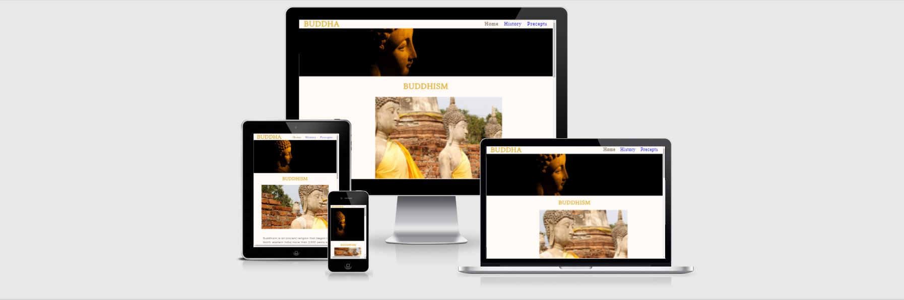

## Features
This website features a sweet and easy way for beginners to learn about buddhism, 
the pages holding information are easy to read and retain. 
Many other websites while holding informtion tend to really try to focus on trying to teach while being very biased through flowery language, this website does not want to a push a decision on anyone but acts as a stepping stone if people want to find their own path.

## Wireframe 

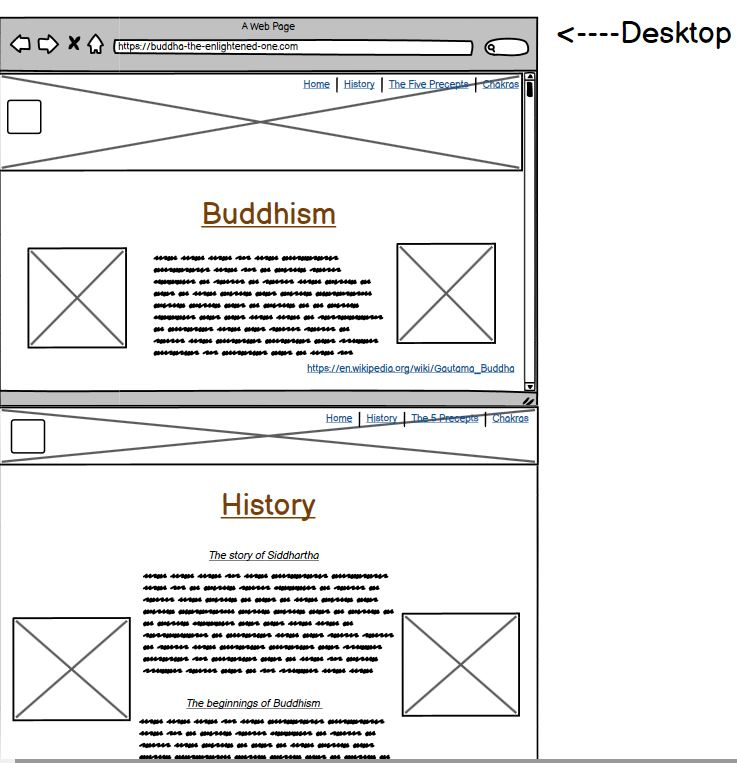
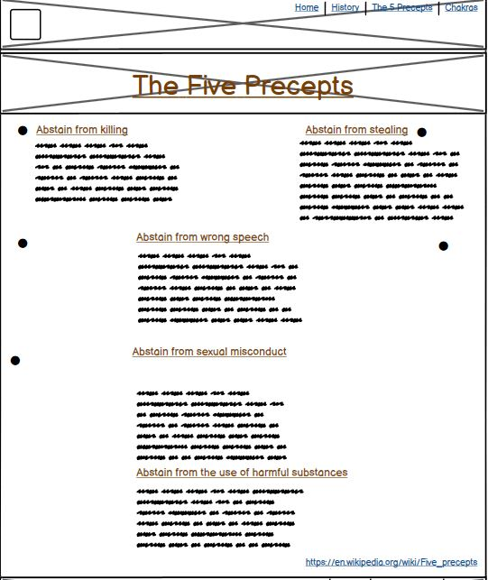
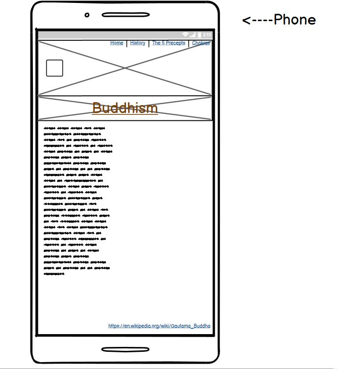

**Existing Features**
 **Navigation Bar**
  
  - Navigation bar on all four pages, link to home page from logo, History page, Precepts page and finally the Sign up page. 
  - the nav links make it very easy to navigate making the website very user friendly.

  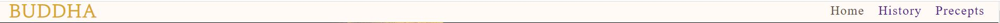

 **Main header image**
  - The image of of a serene photograph of a Buddhist statue, the image is very soothing to look at and sets the vibe of the webpage.

 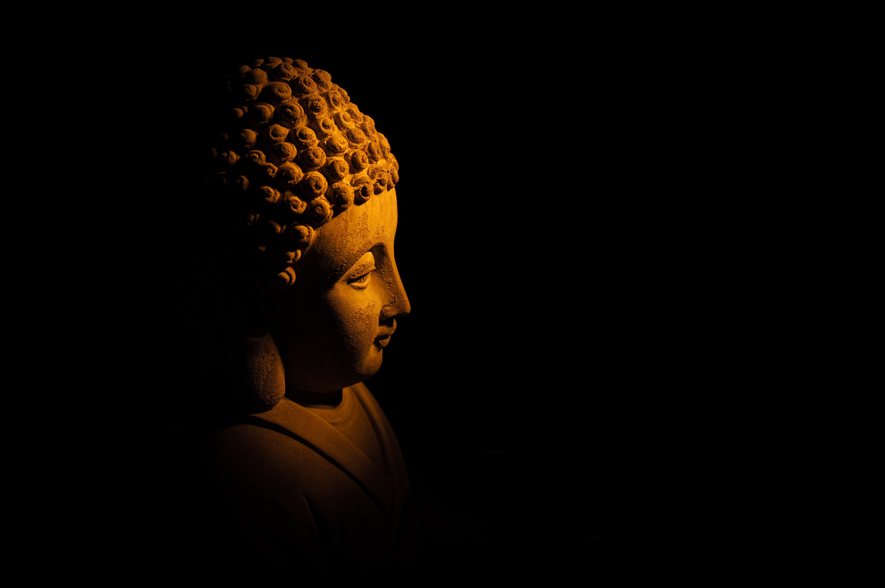

 **Buddhism summery title and image**
  - This is image and title from the home page give off a sense of symetry in both colour and theme whe compared to the main nav image.
  - This is an easy way for someone to understand the theme and story origin even with basic or no prior knowledge of Buddha and Buddhism.

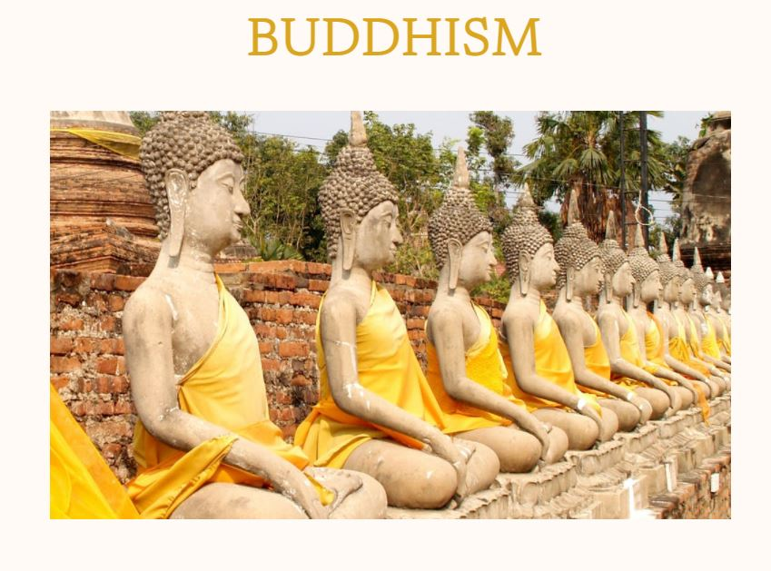 

 **Newsletter sign up prompt**
  - This is a welcoming message to ask the viewer to sign up for an email newsletter.
  - The wording is written to be inviting and give the user a sense of communnity if they choose to sign up.
  - The second image is of the sign up form itself, its user friendly east to navigate. 

   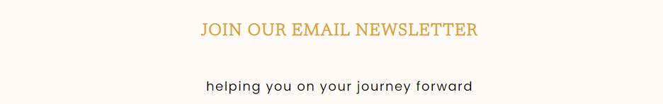
   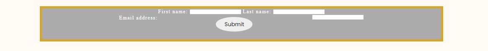

 **Footer, Social  Media links and information link** 
  -The footer consists of high contrast colours, white against black for a sleek vibe yes still in sync with the websites theme.
  -The Social media links are white for easy seeing access and each link goes to a page specifically about Buddhism.

   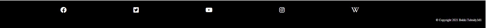

**History**
  -This page gives a detailed explanation of Siddhartha Gautama to became known as Buddha.
  - It is concise but still explains his life from birth to enlightenment, an interesting read for the user.

  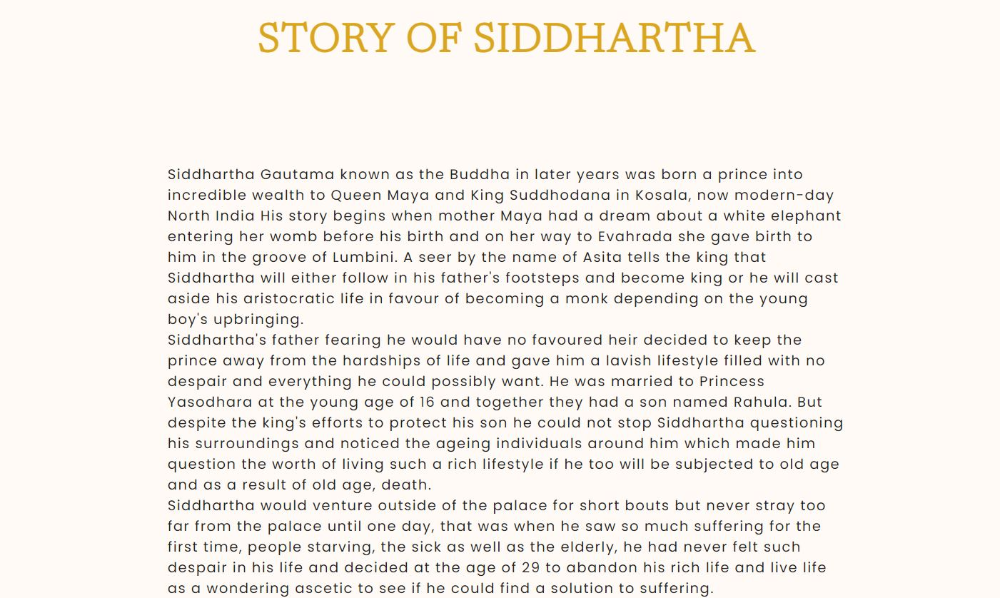

**Precepts** 
  - This page is a more in depth look at the five precepts, what they mean, why are followed and the result of following these rules.
  - The icons used were the "om" symbol and the dharmachakra, the symbols break up the paggages while also helping the entire page keep a flow and theme.
 

 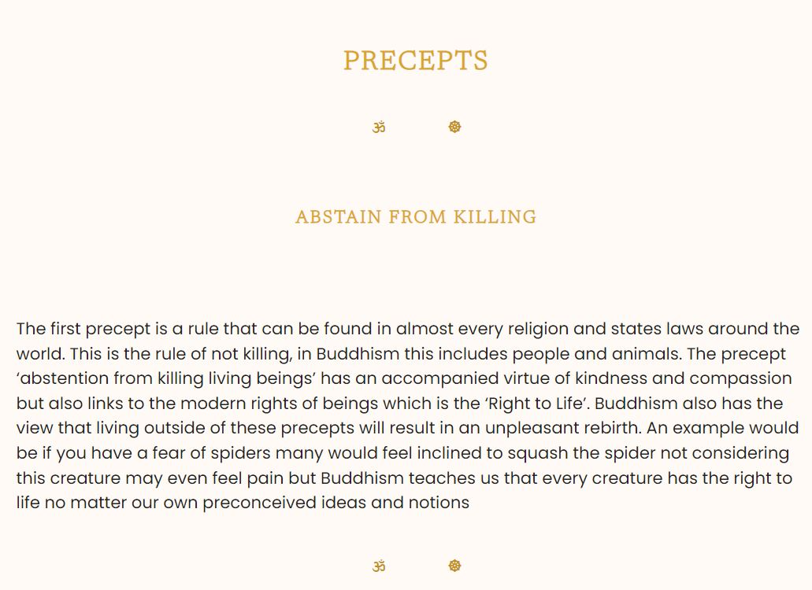

 **Thank you newsletter page** 
   - The form at the end of each page, when the details are added the user is brought to a thank you page with information to check their email for upcoming news about the newsletter.
   -The Buddah text in the upper left brings the user back to the home page for easy navigation.

   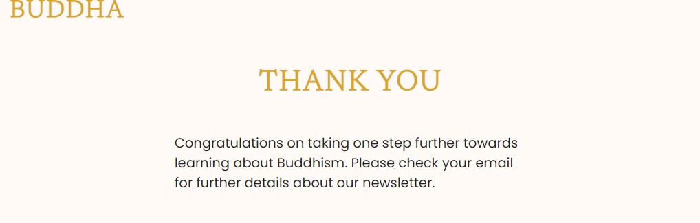

  **Features left to add**
 - videos with more information about Buddhism
 - meet ups for people to meet up for meditation or walks
 - links to local and online seminars from monks for users to learn more
 - to go through more Media queries to make the website even more accessible to more users. 

 ## Testing

- I have conducted many tests to ensure the website works well, I have had to change the nav bar muliple times to make it sit properly which posed quite a challenge at first.

- I have checked the nav links work and bring the user to the right designated page.

- I have checked that all social media links are working fully and bring the user to the exact area specified.

- I have checked that the fixed background image on the home page does not stretch when scrolling.

- I have checked that the sign up form works and brings the user to the newsletter thank you page.

- I have checked the submit button css style works when clicking submit.

Getting the CSS to work perfectly proved to be a good learning curve as I had chosen not to use bootstrap to try challenge myself building everything from scratch.

the resolutions I have tested the website on are as follows 
- Desktop screen
- 1024px width
- 720px width
- 320px width 

### Validator Testing 
- HTML
  - No error found when ran through W3C validator https://validator.w3.org/

- CSS 
  - No errors found when tested on Jigsaw https://jigsaw.w3.org/css-validator/

  ## Deployment 

- My site was deployed through GIitHub pages
  - I navigated through the GitHub respository 
  - Clicked on the seetings tab
  - From the drop down selected the master branch 
  - When the master branch was selected the page was automatically refreshed with a message letting me know my project has been deployed 

  The live link to my webiste can be found here - https://diabekki.github.io/Buddha-the-enlightened-one/index.html

  ## Credits

- The text for the home page was loosely taken from wikipedia https://en.wikipedia.org/wiki/Buddhism
- Instructions for CSS I found difficult was taken from w3schools https://www.w3schools.com/css/default.asp
- Details about the five precepts were taken from buddho https://buddho.org/buddhism-and-morality-the-five-precept/
- Information about Siddhartha was taken from https://artsandculture.google.com/exhibit/indian-buddhist-art-indian-museum-kolkata/sQKy9A-7JPwzJQ?hl=en
- Icons in the Precepts page were taken from Font Awesome https://fontawesome.com/
- Fonts used throughout website was taken from Google Fonts https://fonts.google.com/

## Media 
- Image media was taken from Pexels 

## Acknowledgements

I want to thank my Fiance who kept pushing me to keep bettering myself and not letting me give up, fellow students for letting me vent frustrations when I felt overwhelmed with the work,
Kasia who keeps up our morale and always checks to see if we are doing okay and finally my mentor for guiding me and showing me that even through the worry I can still showcase something I'm proud of. 

